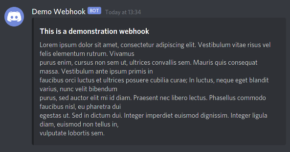

dishook
===

dishook is a small Go module for creating and sending Discord webhooks.

## Usage

```go
package main

import "github.com/jamiemansfield/dishook"

const WebhookUrl = "DISCORD_WEBHOOK_GOES_HERE"

func main() {
	err := dishook.SendWebhook(nil, WebhookUrl, &dishook.Webhook{
		Username: "Demo Webhook",
		Embeds: []*dishook.Embed{
			{
				Title: "This is a demonstration webhook",
				Description: `
Lorem ipsum dolor sit amet, consectetur adipiscing elit. Vestibulum vitae risus vel felis elementum rutrum. Vivamus
purus enim, cursus non sem ut, ultrices convallis sem. Mauris quis consequat massa. Vestibulum ante ipsum primis in
faucibus orci luctus et ultrices posuere cubilia curae; In luctus, neque eget blandit varius, nunc velit bibendum
purus, sed auctor elit mi id diam. Praesent nec libero lectus. Phasellus commodo faucibus nisl, eu pharetra dui
egestas ut. Sed in dictum dui. Integer imperdiet euismod dignissim. Integer ligula diam, euismod non tellus in,
vulputate lobortis sem. 
`,
			},
		},
	})
	if err != nil {
		panic(err)
	}
}
```



## License

This library is made available under the MIT license, found in the [LICENSE.txt]
file.

[LICENSE.txt]: ./LICENSE.txt
